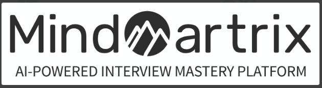

# MindMatrix - AI-Powered Interview Mastery Platform 
  

Welcome to MindMatrix, an AI-Powered Interview Mastery platform! This innovative platform is designed to help students practice for job interviews by simulating real interview scenarios and providing personalized feedback. With the magic of AI and language processing, students can improve their interview skills, build confidence, and increase their chances of success during real interviews.

## Key Features

### Interview Simulator

MindMatrix allows students to have realistic conversations with an AI using the powerful [OpenAI API](https://openai.com/product#made-for-developers). Students can choose the type of interview they want to practice, such as MERN, Node, or Java, and receive a series of relevant questions. The AI will dynamically generate questions and adapt its tone and style of questioning based on the selected interview type, making the practice sessions more engaging and tailored to the student's needs.

### Personalized Feedback

Our AI system analyzes students' interview responses and provides constructive feedback. The feedback evaluates the content, delivery, and overall performance of the student's answers. It highlights the student's strengths and suggests areas for improvement, such as communication skills, technical knowledge, or problem-solving abilities. This valuable feedback helps students identify their weaknesses and work on enhancing their skills.

### User-Friendly Interface

We have designed a user-friendly web interface that is intuitive, visually appealing, and easy to navigate. The platform provides a seamless experience for users, allowing them to focus on their interview preparation without any technical issues. The interface is built using React with TypeScript for the frontend and styled with Tailwind CSS.

## Tech Stack

- Frontend: React with TypeScript, Tailwind CSS
- Backend: Java Spring Boot with MySQL
- OpenAI Integration: [OpenAI API](https://openai.com/) for dynamic question generation and responses
- Data Visualization and Insights: Charts (optional)

## Team Members

We have a talented team of 3 members working on this project:

1. [Akhtar Ansari](https://github.com/akhtaransari) - Backend (Java Spring Boot with MySQL)
2. [Gopi Vishwakarma](https://github.com/ErGopiVishwakarma) - Frontend (React with TypeScript, Tailwind CSS)
3. [Sharvari Hupare](https://github.com/sharvarihupare-369) - Frontend (React with TypeScript, Tailwind CSS)

## Setup Instructions

1. Clone the repository: `git clone [repository_url]`
2. Install dependencies for frontend: `cd frontend && npm install`
3. Install dependencies for backend: `cd backend && mvn install`
4. Start the frontend development server: `npm start`
5. Start the backend server: `mvn spring-boot:run`
6. Access the platform in your web browser at: `http://localhost:3000`

## Presentation

Our team will present the MindMatrix - AI-Powered Interview Mastery platform on Monday, 31st July. We will demonstrate the key features, the technology used, and the overall flow of the platform. We look forward to showcasing our hard work and receiving valuable feedback.

Let's unlock the potential of AI in interview preparation and help students excel in their careers! Thank you for your attention.
